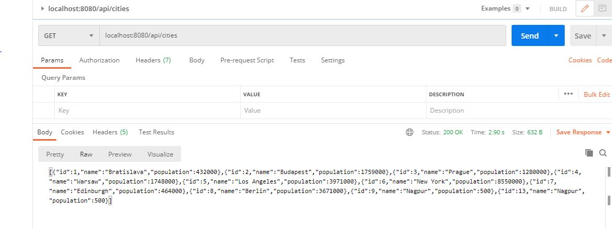
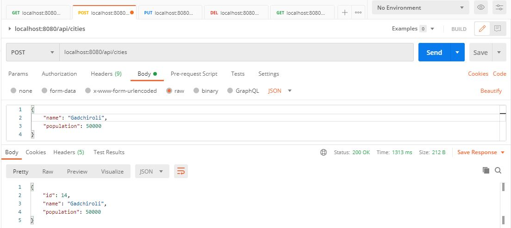
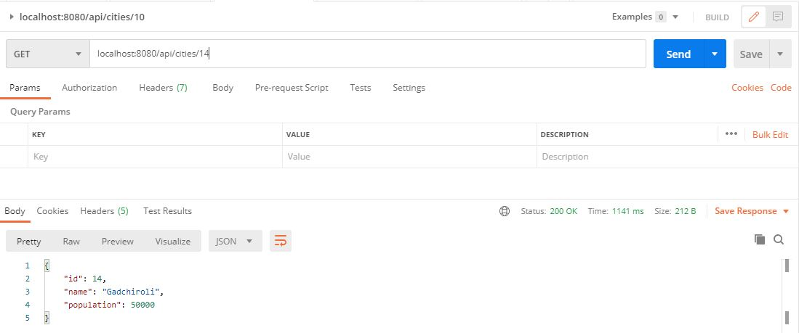
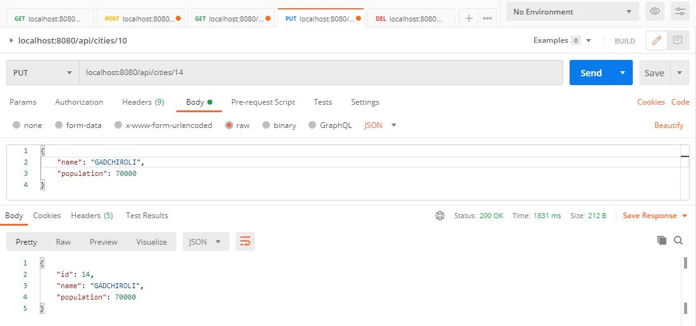
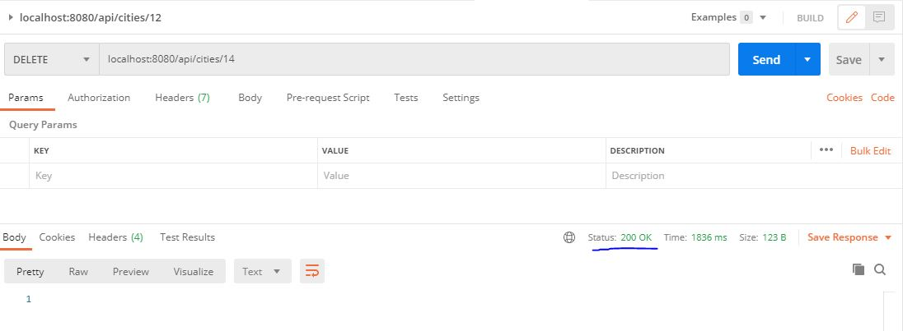

# SpringBootWithMySQL
This is a demo application developed using spring boot + JPA + MySQL + devtools.

#
#### DB Details
- I have used www.db4free.net to create temp DB for this demo application.
- One way to configure datasource using ```application.property``` file for this demo application. 
> https://github.com/prashantsarkar/SpringBootWithMySQL/releases/tag/V1.0

- Another way is to configure data source pragramatically.
> https://github.com/prashantsarkar/SpringBootWithMySQL/releases/tag/V2.0

#
#### List all cities

  
#### Save city
  
  
#### Get City

  
#### Update city
  
  
#### Delete City

